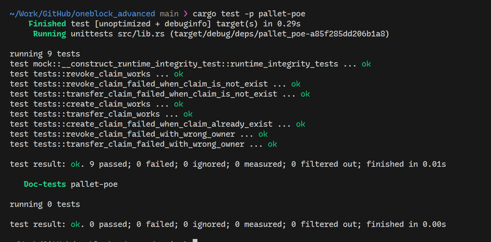
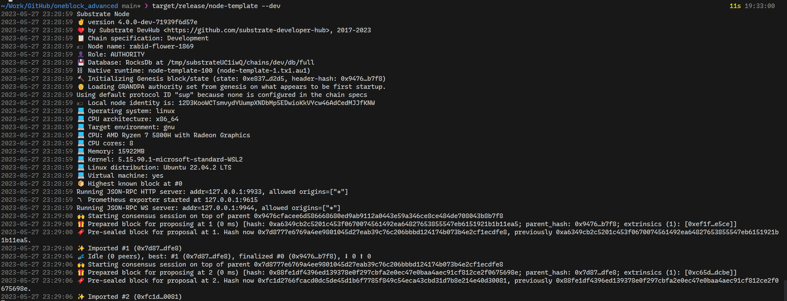
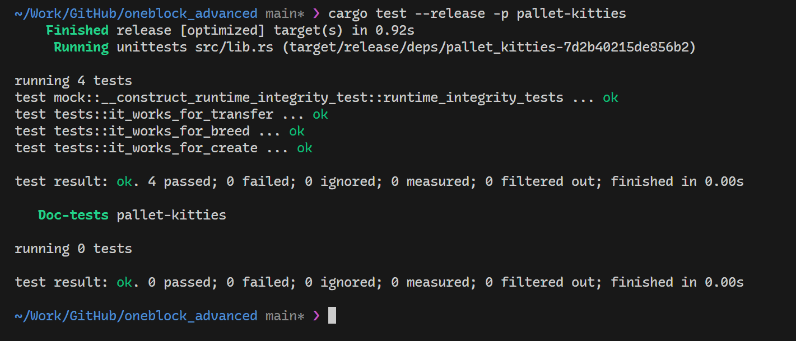
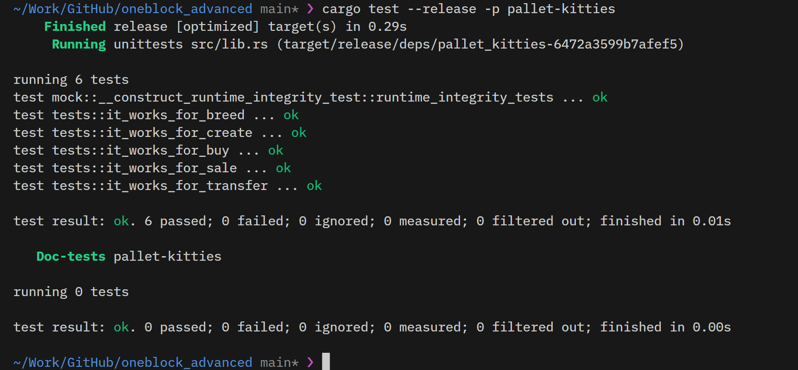
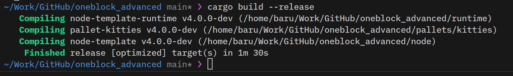
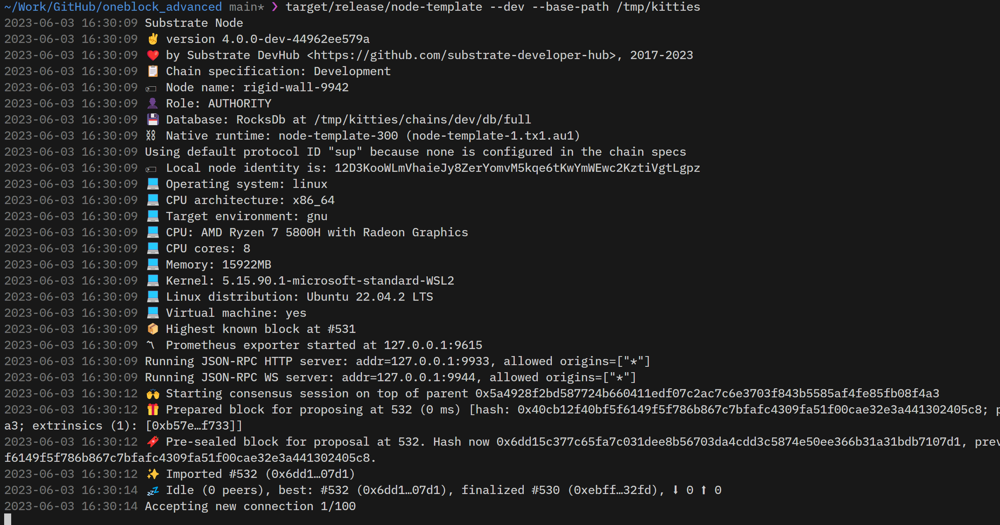
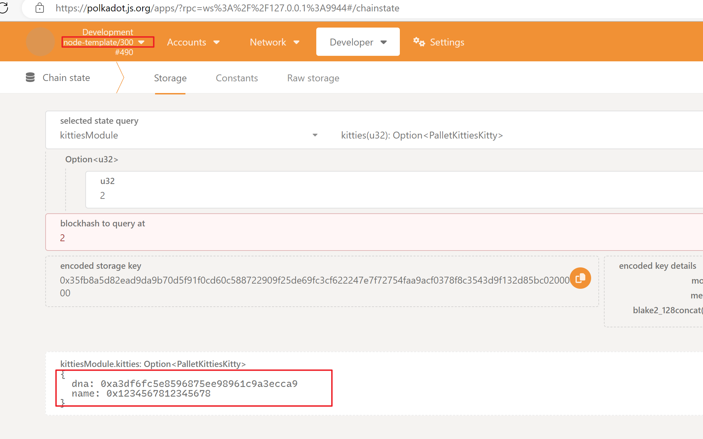

# OneBlock+ 进阶课程作业

## 第一节课作业

### 作业1

编写存证模块的单元测试代码，包括创建存证的测试用例
撤销存证的测试用例
转移存证的测试用例

### 答案：
[pallets/poe/src/tests.rs](./pallets/poe/src/tests.rs)

### 截图：

## 第二节课作业

### 作业1

跟着视频,完成Kitties的开发
* Pallet编译成功
* 单元测试通过
* 加入kitties pallet到runtime中,node可以编译通过
* node节点可以正常启动

### 答案：
[pallets/kitties](./pallets/kitties)

### 截图：

## 第三节课作业

### 作业1

跟着视频,完成Kitties pallet
* 增加 Currency sale/buy 方法后 Pallet 可以编译
* 增加新的测试用例
* 修改 runtime,node可以编译通过
* node节点可以启动

### 答案：
[pallets/kitties](./pallets/kitties)

### 截图：

### 作业2

Runtime 升级
* Kitties palletv2，将 kitties name 扩充到8个字节
* 完成 migration 代码
* 验证从 vO-v2,v1-v2的升级路径

### 答案：
[pallets/kitties](./pallets/kitties)

### 截图：

